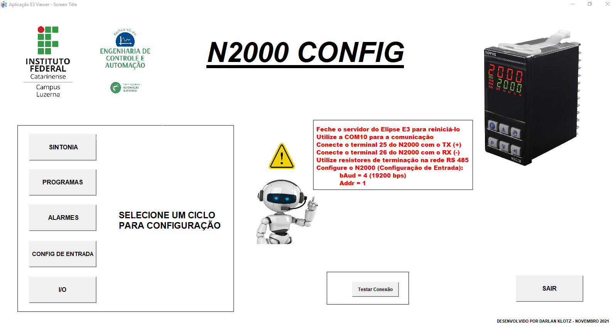

# Config_N2000

Software para configuração / programação dos parâmetros do Controlador N2000 da Novus.

## Características

- Desenvolvido no software Elipse E3 (necessário instalá-lo para rodar a aplicação);
- Comunicação através da rede RS-485;
- Compatível com o controlador Novus N2000 versão V2.1x C;

## Como usar?

Antes da execução do software:
- Feche o servidor do Elipse E3 para reiniciá-lo;
- Utilize a COM10 para a comunicação;
- Conecte o terminal 25 do N2000 com o TX (+);
- Conecte o terminal 26 do N2000 com o RX (-);
- Utilize resistores de terminação na rede RS 485 (120ohms;
- Configure o N2000 (Configuração de Entrada):
  - bAud = 4 (19200 bps);
  - Addr = 1;
